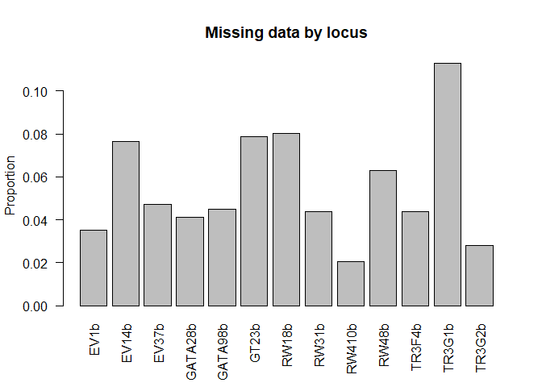
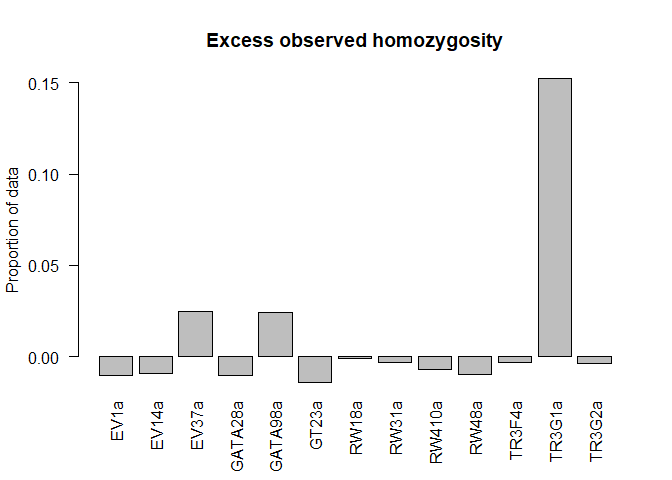
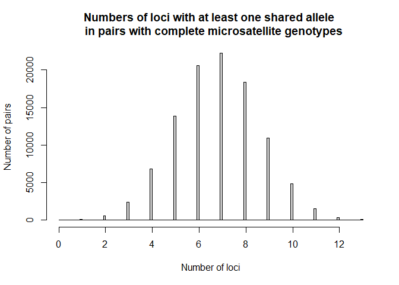
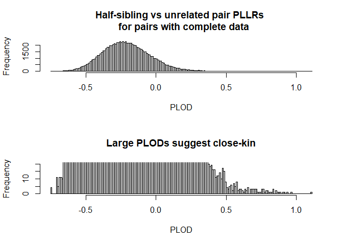

NZSRW kinship analysis
================
Robin Aldridge-Sutton

  - [Introduction](#introduction)
  - [Missing data and dropout for microsatellite
    genotypes](#missing-data-and-dropout-for-microsatellite-genotypes)
  - [Shared microsatellite alleles, kinship likelihoods, and possible
    parent-offspring
    pairs](#shared-microsatellite-alleles-kinship-likelihoods-and-possible-parent-offspring-pairs)
  - [Kinship log likelihoods based on sexes and
    haplotypes](#kinship-log-likelihoods-based-on-sexes-and-haplotypes)
  - [Combined kinship log likelihood
    ratios](#combined-kinship-log-likelihood-ratios)

### Introduction

This is an analysis of the pairwise kinships among a sample of NZ
southern right whales using microsatellite genotypes, MtDNA haplotypes,
and sex. It is organised into 6 numbered scripts, and source\_scripts.R
is used to conveniently call those that are required when changes are
made. It takes multiple csv files as inputs, and writes a single new csv
file with integrated data for \~95% of the animals sampled. The data are
largely from [Carroll, Emma. (2012) Return of the right whale:
Assessment of abundance, population structure and geneflow in the New
Zealand southern right whale](http://hdl.handle.net/2292/11541). The
main results are summarised in the other sections of this readme.

For each pair it finds the number of microsatellite loci at which they
share one or two alleles, as a simple heuristic for kinship, then it
finds pseudolikelihoods given to various simple kinships by all of the
data, and the half-sibling versus unrelated pair pseudo-log likelihood
ratios.

It saves pairs which could be POPs according to their observed
microsatellite genotypes, and has a shiny app to display them along with
one of the years and locations at which they were sampled, but I took it
down because I have not been able to distinguish likely POPs so far.

The likelihood calculations could probably be sped up and simplified by
finding all possible geno-, haplo-, and sex-pair probabilities just
once, and then just indexing them for each observed pair, and by setting
probabilities for missing data to 1 when they are no longer needed for
adding probabilities over cases. But these are probably not worth doing
unless I end up running simulations with this kind of data.

### Missing data and dropout for microsatellite genotypes

Locus TR3G1 had the most missing data, and is the only one with
significant excess homozygosity.

<!-- -->

<!-- -->

From Emma’s thesis (pg.84):

“Of the 13 loci retained in the dataset, 12 did not deviate
significantly from Hardy-Weinberg equilibrium and showed no signs of
stutter, allelic dropout or null alleles (Table 2.5). The exception was
TR3G1; this locus had evidence of allelic dropout but was retained as it
was highly informative and allelic dropout was accounted for by
re-amplifying mismatching loci for suspected replicate samples.”

If we had borderline cases of kinship we could check how this affected
them.

### Shared microsatellite alleles, kinship likelihoods, and possible parent-offspring pairs

Parent-offspring pairs (POPs) share an allele by descent at each locus.
This is not enough to distinguish them with these microsatellite
genotypes, but we can find the pairs that could possibly be POPs
according to them (bearing in mind genotyping error), and check that the
more sophisticated analyses below give the same results.

<!-- -->

It is possible to have genotypes that share an allele at a locus but
which are still more likely to be unrelated than to be a POP. For
example, if a pair of microsatellite genotypes are each heterozygous at
a locus, and only shares one allele, the conditional probability of the
second given that they are unrelated is twice the product of the allele
probabilities, and given that they are a POP it is half the unshared
allele probability. So if the probability of the shared allele is
greater than one quarter, the unrelated pair prob is higher. For SNPs,
allele probabilities are often greater than one quarter, but you can’t
have two heterozygous genotypes that only share one allele. Many of the
microsatellite alleles in this dataset have probabilities greater than
one quarter, and a few pairs share an allele at every locus but are more
likely to be UPs.

Here are the proportions of microsatellite loci where alleles are
shared, the likelihoods given to the main simple kinships, and the
maximum likelihood kinship, for the first few genopairs, and the first
few possible POPs.

    ##   p_0  p_1  p_2 n_loci     UP     SOK PO_OP   PO   OP   SOKx2   SP MLK
    ##  0.69 0.31 0.00     13 -96.49 -102.00  -Inf -Inf -Inf -109.21 -Inf  UP
    ##  0.77 0.15 0.08     13 -95.03 -100.43  -Inf -Inf -Inf -107.17 -Inf  UP
    ##  0.54 0.46 0.00     13 -95.61  -98.87  -Inf -Inf -Inf -105.09 -Inf  UP
    ##  0.46 0.46 0.08     13 -97.86  -99.26  -Inf -Inf -Inf -103.67 -Inf  UP
    ##  0.70 0.00 0.30     10 -74.41  -76.35  -Inf -Inf -Inf  -77.85 -Inf  UP
    ##  0.46 0.54 0.00     13 -97.09  -99.45  -Inf -Inf -Inf -105.25 -Inf  UP

    ##  p_0  p_1  p_2 n_loci     UP    SOK  PO_OP     PO     OP  SOKx2   SP   MLK
    ##    0 0.83 0.17     12 -84.62 -76.41 -72.05 -72.05 -72.05 -75.49 -Inf PO_OP
    ##    0 0.89 0.11      9 -61.65 -56.90 -54.46 -54.46 -54.46 -57.39 -Inf PO_OP
    ##    0 1.00 0.00     10 -65.09 -61.46 -59.23 -59.23 -59.23 -63.50 -Inf PO_OP
    ##    0 0.40 0.60     10 -70.11 -61.23 -57.35 -57.35 -57.35 -54.47 -Inf SOKx2
    ##    0 0.69 0.31     13 -92.46 -82.06 -78.42 -78.42 -78.42 -79.41 -Inf PO_OP
    ##    0 0.88 0.12      8 -53.44 -50.97 -49.47 -49.47 -49.47 -51.74 -Inf PO_OP

### Kinship log likelihoods based on sexes and haplotypes

Here are the sexes and haplotypes, the likelihoods given by them to the
main simple kinships, and the maximum likelihood kinship, for a random
sample of genopairs. When any of the data is missing the likelihoods are
ignored although it is possible to calculate them later if necessary.

    ##  SEX      DLP SEX.1    DLP.1    UP   SOK PO_OP    PO    OP SOKX2    SP MLK
    ##    M BakHapB'     M  BakHapA -4.58 -5.27 -4.58 -4.58 -4.58  -Inf  -Inf  UP
    ##    M  BakHapA     M  BakHapA -3.54 -2.86 -3.54 -3.54 -3.54 -2.46 -1.77  SP
    ##    M  BakHapA     F  BakHapD -4.66 -5.35 -5.35 -4.66  -Inf  -Inf  -Inf  UP
    ##    M  BakHapA     F BakHapB' -4.58 -5.27 -5.27 -4.58  -Inf  -Inf  -Inf  UP
    ##    F  BakHapA     F  BakHapA -3.54 -2.86 -2.46 -2.46 -2.46 -2.46 -1.77  SP
    ##    F  BakHapA     F  BakHapA -3.54 -2.86 -2.46 -2.46 -2.46 -2.46 -1.77  SP
    ##    M  BakHapD     M  BakHapA -4.66 -5.35 -4.66 -4.66 -4.66  -Inf  -Inf  UP
    ##    M  BakHapC     F  BakHapA -4.96 -5.66 -5.66 -4.96  -Inf  -Inf  -Inf  UP
    ##    M BakHapB+     F BakHapB+ -3.78 -3.01 -3.01 -3.78 -2.58 -2.58  -Inf  OP
    ##    F  BakHapC     F  BakHapA -4.96 -5.66  -Inf  -Inf  -Inf  -Inf  -Inf  UP

### Combined kinship log likelihood ratios

The pseudo-log likelihood ratios do not clearly distinguish any kinships
for this data, although it may be possible to apply a thresholding
technique later.

<!-- -->
