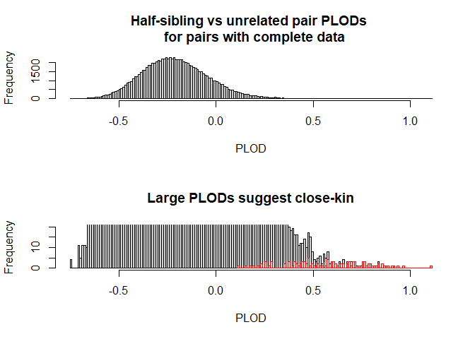
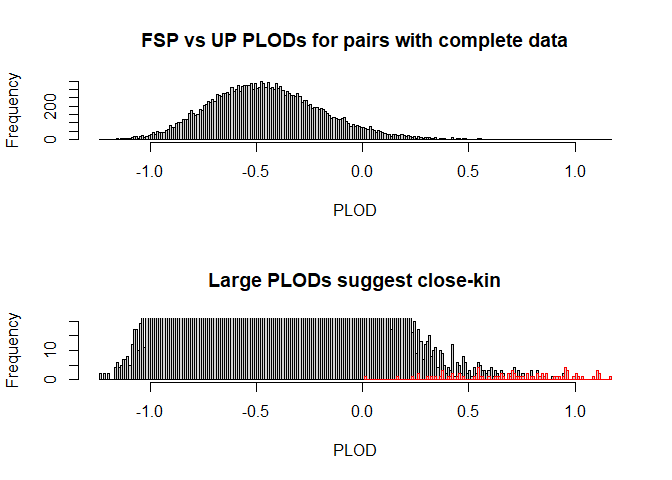

NZSRW kinship analysis
================
Robin Aldridge-Sutton

  - [Introduction](#introduction)
  - [Missing data and dropout for microsatellite
    genotypes](#missing-data-and-dropout-for-microsatellite-genotypes)
  - [Shared microsatellite alleles, kinship likelihoods, and
    parent-offspring
    pairs](#shared-microsatellite-alleles-kinship-likelihoods-and-parent-offspring-pairs)
  - [Kinship log likelihoods based on sexes and
    haplotypes](#kinship-log-likelihoods-based-on-sexes-and-haplotypes)
  - [Combined kinship log likelihood
    ratios](#combined-kinship-log-likelihood-ratios)

### Introduction

This is an analysis of the pairwise kinships among a sample of NZ
southern right whales using microsatellite genotypes, MtDNA haplotypes,
and sex. It is organised into 6 numbered scripts, and source\_scripts.R
is used to conveniently call those that are required when changes are
made. It takes multiple csv files as inputs, and writes a single new csv
file with integrated data for \~90% of the animals sampled. The data are
largely from [Carroll, Emma. (2012) Return of the right whale:
Assessment of abundance, population structure and geneflow in the New
Zealand southern right whale.](http://hdl.handle.net/2292/11541)

For each pair it finds the number of microsatellite loci at which they
share one or two alleles, as a simple heuristic for kinship, then it
finds the precise likelihoods given to various simple kinships by all of
the data, and the half and full-sibling versus unrelated pair log
likelihood ratios.

It saves pairs which could be POPs according to their observed
microsatellite genotypes, and has a shiny app to display them along with
one of the years and locations at which they were sampled, but I took it
down because I have not been able to distinguish likely POPs so far.

The likelihood calculations could probably be sped up and simplified by
finding all possible geno-, haplo-, and sex-pair probabilities just
once, and then just indexing them for each observed pair, and by setting
probabilities for missing data to 1 when they are no longer needed for
adding probabilities over cases. But these are probably not worth doing
unless I end up running simulations with this kind of data.

Things to do: - Update the report. Don’t need too much detail, just the
main results/explanation. - Add a link to my dissertation for
explanation.

``` r
# Load results of analysis
load(file = "rdata/whale_analysis_6.Rdata")
```

### Missing data and dropout for microsatellite genotypes

Locus TR3G1 had the most missing data, and is the only one with
significant excess homozygosity.

``` r
# Find and show proportions of missing data by locus from largest to smallest
barplot(
  colMeans(missing_ales_2),
  las = 2,
  main = "Missing data by locus",
  ylab = "Proportion"
)
```

<!-- -->

``` r
# Find the excess observed homozygosity at each locus
props_homo_exp <- sapply(ale_dists, function(dist) sum(dist^2))
props_homo_obs <- colMeans(ales_mat_1 == ales_mat_2, na.rm = T)

# Show observed versus expected homozygosity by locus from largest to smallest
# difference
barplot(
  props_homo_obs - props_homo_exp,
  las = 2,
  main = "Excess observed homozygosity",
  ylab = "Proportion of data"
)
```

<!-- -->

From Emma’s thesis (pg.84):

“Of the 13 loci retained in the dataset, 12 did not deviate
significantly from Hardy-Weinberg equilibrium and showed no signs of
stutter, allelic dropout or null alleles (Table 2.5). The exception was
TR3G1; this locus had evidence of allelic dropout but was retained as it
was highly informative and allelic dropout was accounted for by
re-amplifying mismatching loci for suspected replicate samples.”

If we had borderline cases of kinship we could check how this affected
them.

### Shared microsatellite alleles, kinship likelihoods, and parent-offspring pairs

Parent-offspring pairs (POPs) share an allele by descent at each locus.
This is not enough to distinguish them from these microsatellite
genotypes, but we can find the pairs that could possibly be POPs
according to them (bearing in mind genotyping error), and check that the
more sophisticated analyses below give the same results.

``` r
# Plot the proportions of loci where pairs are observed to share at least one
# allele
hist(
  ns_loci_ales_shared[ns_loci_both_obs == 13],
  breaks = 100,
  main = "Numbers of loci with at least one shared allele in 
  pairs with complete microsatellite genotypes",
  xlab = "Number of loci",
  ylab = "Number of pairs"
)
```

<!-- -->

``` r
# Check same possible POPs from shared microsatellite alleles and kinship likelihoods
all(which(is.finite(kin_log_likes_msats$PO_OP)) == possible_pop_inds)
```

    ## [1] TRUE

It is possible to have genotypes that share an allele at a locus but
which are still more likely to be unrelated than to be a POP. For
example, if a pair of microsatellite genotypes are each heterozygous at
a locus, and only shares one allele, the conditional probability of the
second given that they are unrelated is twice the product of the allele
probabilities, and given that they are a POP it is half the unshared
allele probability. So if the probability of the shared allele is
greater than one quarter, the unrelated pair prob is higher. For SNPs,
allele probabilities are often greater than one quarter, but you can’t
have two heterozygous genotypes that only share one allele. Many of the
microsatellite alleles in this dataset have probabilities greater than
one quarter, and a few pairs share an allele at every locus but are more
likely to be UPs.

Maybe have the proportions of loci with one or two alleles shared, along
with the msat only likelihoods here.

``` r
# Create table of kinship analysis data, including proportions of msat loci with
# 0, 1, and 2 alleles shared, kinship likelihoods, and most likely kinship
pairs_data <- data.frame(
  props_loci_ns_ales_shared,
  round(kin_log_likes_msats, 2),
  MLK = max_like_kinships_msats
)

print(head(pairs_data), row.names = F)
```

    ##   p_0  p_1  p_2 n_loci     UP     SOK PO_OP   PO   OP   SOKx2   SP MLK
    ##  0.69 0.31 0.00     13 -96.49 -102.00  -Inf -Inf -Inf -109.21 -Inf  UP
    ##  0.77 0.15 0.08     13 -95.03 -100.43  -Inf -Inf -Inf -107.17 -Inf  UP
    ##  0.54 0.46 0.00     13 -95.61  -98.87  -Inf -Inf -Inf -105.09 -Inf  UP
    ##  0.46 0.46 0.08     13 -97.86  -99.26  -Inf -Inf -Inf -103.67 -Inf  UP
    ##  0.70 0.00 0.30     10 -74.41  -76.35  -Inf -Inf -Inf  -77.85 -Inf  UP
    ##  0.46 0.54 0.00     13 -97.09  -99.45  -Inf -Inf -Inf -105.25 -Inf  UP

``` r
print(pairs_data[head(possible_pop_inds), ], row.names = F)
```

    ##  p_0  p_1  p_2 n_loci     UP    SOK  PO_OP     PO     OP  SOKx2   SP   MLK
    ##    0 0.83 0.17     12 -84.62 -76.41 -72.05 -72.05 -72.05 -75.49 -Inf PO_OP
    ##    0 0.89 0.11      9 -61.65 -56.90 -54.46 -54.46 -54.46 -57.39 -Inf PO_OP
    ##    0 1.00 0.00     10 -65.09 -61.46 -59.23 -59.23 -59.23 -63.50 -Inf PO_OP
    ##    0 0.40 0.60     10 -70.11 -61.23 -57.35 -57.35 -57.35 -54.47 -Inf SOKx2
    ##    0 0.69 0.31     13 -92.46 -82.06 -78.42 -78.42 -78.42 -79.41 -Inf PO_OP
    ##    0 0.88 0.12      8 -53.44 -50.97 -49.47 -49.47 -49.47 -51.74 -Inf PO_OP

### Kinship log likelihoods based on sexes and haplotypes

Then the hap and sex and hap-sex-only likelihoods here.

``` r
# Show kinship likelihoods given haplopairs and sexes for random selection of
# animals
pairs_data <- data.frame(
  whale_data[ani_inds_1, 2:3],
  whale_data[ani_inds_2, 2:3],
  round(kin_log_likes_hps_sexes, 2),
  MLK = max_like_kinships_hps_sexes
)
print(pairs_data[sample(n_pairs, 10), ], row.names = F)
```

    ##  SEX      DLP SEX.1    DLP.1    UP   SOK PO_OP    PO    OP SOKX2   SP MLK
    ##    M  BakHapC     F  BakHapA -4.96 -5.66 -5.66 -4.96  -Inf  -Inf -Inf  UP
    ##    M  BakHapA     F  BakHapA -3.54 -2.86 -2.86 -3.54 -2.46 -2.46 -Inf  OP
    ##    M  BakHapA     F  BakHapA -3.54 -2.86 -2.86 -3.54 -2.46 -2.46 -Inf  OP
    ##    M  BakHapA     F BakHapB+ -3.66 -4.35 -4.35 -3.66  -Inf  -Inf -Inf  UP
    ##    F BakHapB+     M BakHapB+ -3.78 -3.01 -3.01 -2.58 -3.78 -2.58 -Inf  PO
    ##    M BakHapB+     F BakHapB' -4.70 -5.39 -5.39 -4.70  -Inf  -Inf -Inf  UP
    ##    M  BakHapD     F PatHap04 -7.24 -7.94 -7.94 -7.24  -Inf  -Inf -Inf  UP
    ##    M  BakHapA     M BakHapB+ -3.66 -4.35 -3.66 -3.66 -3.66  -Inf -Inf  UP
    ##    F  BakHapA     F BakHapB+ -3.66 -4.35  -Inf  -Inf  -Inf  -Inf -Inf  UP
    ##    M BakHapB'     M BakHapB+ -4.70 -5.39 -4.70 -4.70 -4.70  -Inf -Inf  UP

``` r
# The former are sometimes ignored when the haplotypes are known but one or both
# of the sexes are unknown (eg. when it is less trivial than for unrelated
# pairs) but this almost never happens in this data. It would be easy to add
# later, as they are just the weighted averages of the possible cases.
```

### Combined kinship log likelihood ratios

Then the combined likelihoods and plods here.

``` r
# Show numbers of maximum likeihood kinships
max_like_kin_tab
```

    ##     UP    SOK  PO_OP     PO     OP  SOKx2     SP 
    ## 296271  41218    311    142    147    987      0

``` r
# Show numbers of maximum likeihood kinships for possible POPs
table(max_like_kinships[possible_pop_inds])
```

    ## 
    ##    OP    PO PO_OP   SOK SOKx2    UP 
    ##   147   142   311    76    16     7

``` r
# Plot half-siblings versus unrelated pair plods for pairs with complete data

# Set two plots per page
par(mfrow = c(2, 1))

# Plot full histogram
hist(
  hsp_up_plods_comp, 
  breaks = 200,
  main = "PLODs for pairs with complete data",
  xlab = "PLOD"
)

# Show rare values
hist(
  hsp_up_plods_comp, 
  breaks = 200,
  main = "Large PLODs suggest close-kin",
  xlab = "PLOD",
  ylim = c(0, 20)
)

# Plot PLODs for possible POPs
poss_pop_hsp_plods_comp_hist_data <- hist(
  poss_pop_hsp_plods_comp, 
  breaks = 100,
  plot = F
)
plot(poss_pop_hsp_plods_comp_hist_data, add = T, border = 'red')
```

<!-- -->

``` r
# The possible POPs that were more likely to be UPs had missing data, not
# surprising.  
```

``` r
# Plot full-sibling versus unrelated pair plods for pairs with complete data

# Set two plots per page
par(mfrow = c(2, 1))

# Plot full histogram
hist(
  fsp_up_plods_comp, 
  breaks = 200,
  main = "FSP vs UP PLODs for pairs with complete data",
  xlab = "PLOD"
)

# Show rare values
hist(
  fsp_up_plods_comp, 
  breaks = 200,
  main = "Large PLODs suggest close-kin",
  xlab = "PLOD",
  ylim = c(0, 20)
)

# Plot PLODs for possible POPs
poss_pop_fsp_plods_comp_hist_data <- hist(
  poss_pop_fsp_plods_comp, 
  breaks = 100,
  plot = F
)
plot(poss_pop_fsp_plods_comp_hist_data, add = T, border = 'red')
```

<!-- -->

``` r
# Not much different.  Seems more noisy?  Widens the curve, but also pushes the
# possible POPs to the right and narrows their curve?  Should check for the RAD
# data.  Doesn't look like this data is enough to distinguish the actual POPs by
# this method alone.
```
